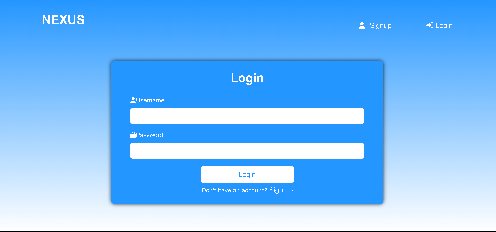
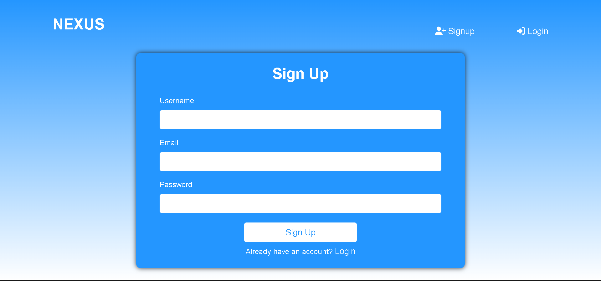
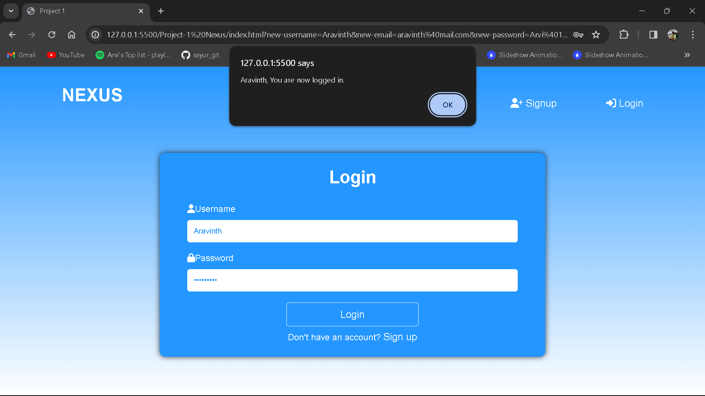
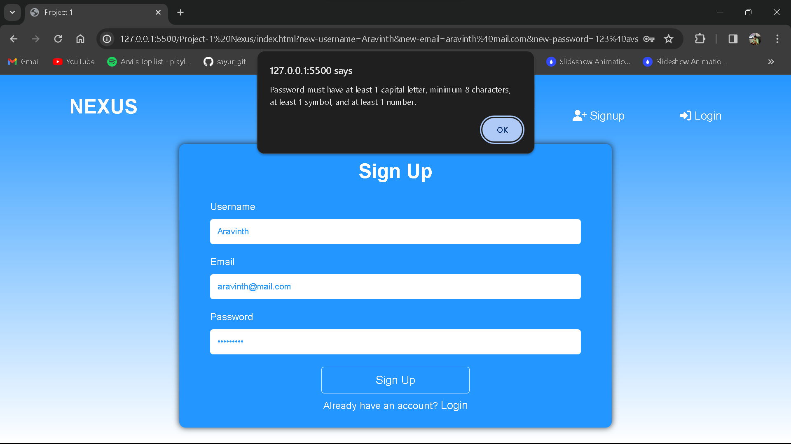
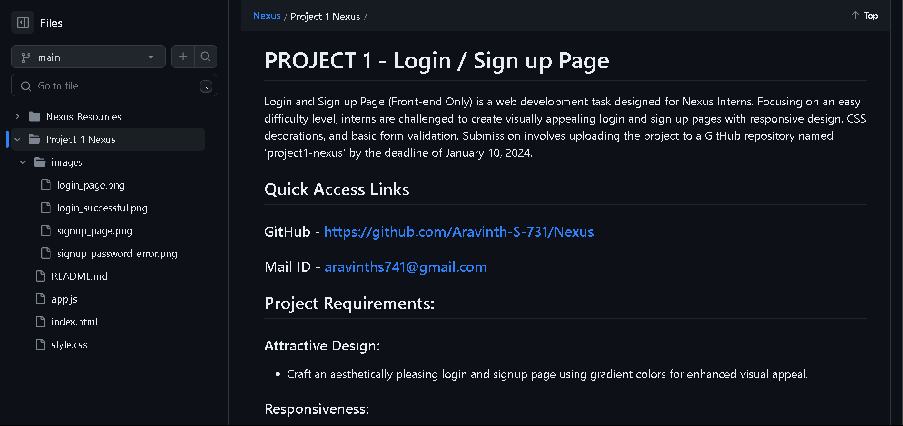

# PROJECT 1 - Login / Sign up Page

Login and Sign up Page (Front-end Only) is a web development task designed for Nexus Interns. Focusing on an easy difficulty level, interns are challenged to create visually appealing login and sign up pages with responsive design, CSS decorations, and basic form validation. Submission involves uploading the project to a GitHub repository named 'project1-nexus' by the deadline of January 10, 2024.

## Quick Access Links
### GitHub - https://github.com/Aravinth-S-731/Nexus
### Mail ID - aravinths741@gmail.com

## Project Requirements:

### Attractive Design:
- Craft an aesthetically pleasing login and signup page using gradient colors for enhanced visual appeal.
### Responsiveness:
- Ensure the login and signup page provides an optimal user experience across various devices and screen sizes.
### CSS Decorations:
- Maximize the use of CSS to add decorative elements, experimenting with styles, fonts, and spacing for visual engagement.
### Form Validation:
- Implement basic form validation for the signup page, displaying error messages for invalid inputs to enhance user-friendliness.
### GitHub Repository:
- Upload the project to a GitHub repository named "project1-nexus" and provide organized documentation within the repository.

---
---
<br/>

# Project Outcome

## File Structure
```
Project-1 Nexus
|
|---  index.html
|--- style.css
|--- app.js
|--- images
     |
     |--- login_page.png
     |--- login_successful.png
     |--- signup_page.png
     |--- signup_password_error.png
     |--- GitHub.png
```

## CSS Design System
```
:root{
    --primary:      #2496ff;
    --secondary:    #151515;
    --font:         #ffffff;
    --font-family:  'Montserrat', sans-serif;
}
```

## Login and Sign up Page



## Dependencies




---
---
<br/>

# Conclusion

In completing the Nexus Internship Web Development Project - Phase 1, I have successfully crafted a visually appealing and responsive Login and Signup Page. The project outcomes showcase a keen eye for design, utilizing gradient colors and creative CSS decorations to enhance the overall user experience. The implementation of form validation on the signup page ensures data integrity and user-friendly error handling.
This project has not only strengthened my front-end development skills but also instilled a disciplined approach to project organization and documentation. I look forward to further challenges in the Nexus Internship and the upcoming coding contest on January 11, 2024.